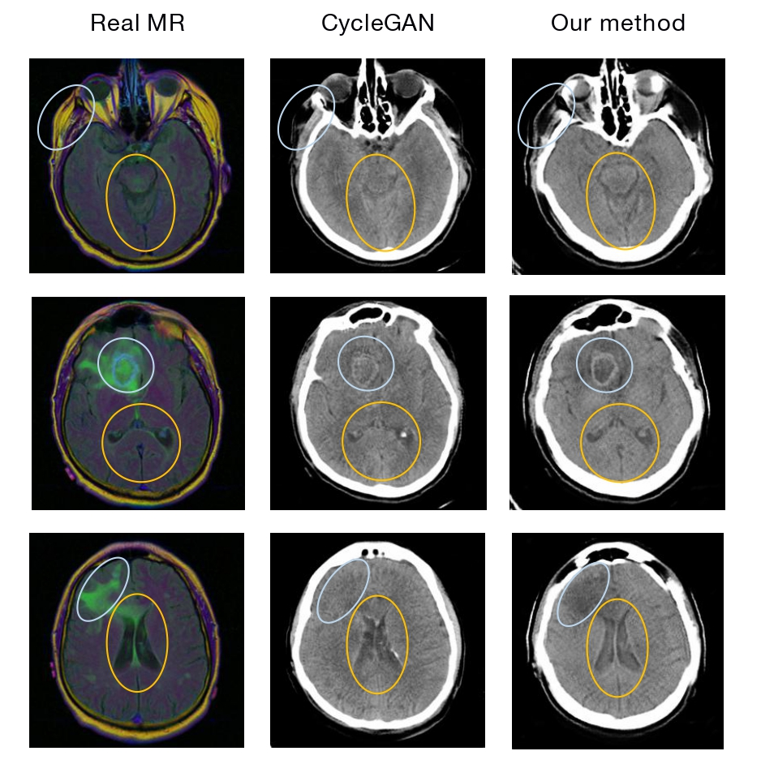

> To be done (Under construction)

#### My researches interests
I'm interested in any attracting knowledge in robotics and learning algorithms. 

My current research covers the following directions:
- Multi-Agent Path Planning
- Multi-Modality Learning in medical imaging
- Self-supervised Learning

#### Publications and Preprints

##### AI applications in healthcare

|-|-|
| **Yue Yang** and Pengtao Xie, "*Discriminative Cross-Modal Data Augmentation for Medical Imaging Applications*", in submission to a top conference. [\[arxiv link\]](https://arxiv.org/abs/2010.03468)  |  | 

Xuehai He* , Xingyi Yang*, **Yue Yang**, Ruofan Guo, Yuxiao Liang, Shanghang Zhang, Li Du, and Pengtao Xie, 
"*Supervised Pretraining or Self-supervised Pretraining? A Tale of Two Transfer Learning Paradigms*", in submission to a top conference.

Guangtao Zeng, Wenmian Yang, Zeqian Ju, **Yue Yang**, Sicheng Wang, Ruisi Zhang, Meng Zhou, Jiaqi Zeng, Xiangyu Dong,
Ruoyu Zhang, Hongchao Fang, Penghui Zhu, Shu Chen, and Pengtao Xie, "*MedDialog: A Large-scale Medical Dialogue Dataset*", in EMNLP 2020

##### Robotics
|-|-|
| **Yue Yang**, Jing Liang, and Jia Pan, "*BCBSD: Anytime Bounded Conflicted-Based Algorithm for Dynamic Environments*", in preparation. |  | 

#### My projects
- [Hospital Information System (HIS)](https://github.com/The-chosen/Hospital-Information-System-NEU-proj): A web development project related to medical system.
- [ArtRobot](https://github.com/The-chosen/ArtRobot-NEU): The project for the 14th NXP Cup National University Students Intelligent Car Race (1st Prize)
- To be updated ...

#### For more details
- My [CV](https://github.com/The-chosen/The-chosen.github.io/blob/master/CV_Yue_Yang(keep%20updating).pdf) (Under updating)
- My [Github](https://github.com/The-chosen) (Under updating)

<!-- Hi, I am _@huxpro_ (Huang, Xuan), a software engineer & a designer. I am currently working on programming langugaes at [Facebook](https://www.facebook.com/). I previously worked as Web Front-End Engineer at [Alibaba Trip](https://www.alitrip.com/); Web Front-End Infrastructure Team Lead at [Wepiao.com](https://www.crunchbase.com/organization/wepiao#/entity); And [Invited Consultant on PWA](<(https://medium.com/elemefe/upgrading-ele-me-to-progressive-web-app-2a446832e509)>) at [Ele.me](https://github.com/elemefe/).

I studied Digital Media Art and graduated from [Communication University of China](https://en.wikipedia.org/wiki/Communication_University_of_China) by 2016, and am studying Computer Science at [Rochester Institute of Technology](https://en.wikipedia.org/wiki/Rochester_Institute_of_Technology) from 2017. -->

<!-- |     | 💔️           | ❤️ ️                                          | ❤️❤️ ️                                          | ❤️❤️❤️ ️                                      |
| --- | ------------- | --------------------------------------------- | ----------------------------------------------- | --------------------------------------------- |
| 😅  | `PHP` `BASIC` | `C` `Prolog`   `Objective-C`               | `Kotlin` `Dart` `MIPS`                          | `Swift` `Agda` `Idris`                        |
| 🧐  |               | `C++` `Hack`   `Scheme` `Racket` `Clojure` | `C++ >11` `C#` `Typed Py`   `ActionScript 3` | `Scala` `Rust`                                |
| 😏  | `Shell`       | `Java` `Python`                               | `TypeScript` `Flow` `WASM`                      | `Haskell` `Coq`   `SML` `OCaml` `ReasonML` |
| 🤓  |               | `JavaScript`                                  | `Javascript >ES6`                               | `λ` `Λ` `Π` `Σ`                               |

> To be continue: `Fortran` `Smalltalk` `Pascal` `Forth` `Ruby` `CoffeeScript` `Go` `Elm` `Erlang` `Elixir` `F#` `F*` `Q#` `Nim` `Haxe` `Cyclone` `VimScript` `Perl` `Lua` `AppleScript` -->

<!-- - [Upgrading to Progressive Web Apps][9] · [JSConf China Shanghai 2017](http://2017.jsconf.cn/)
- Building Progressive Web Apps · [CSDI Guangzhou 2017](http://www.csdisummit.com/)
- The State of Progressive Web App · GDG IO Redux Beijing 2017
- PWA Rehashing · Baidu HQ Beijing 2017
- [Service Worker 101][5] · GDG DevFest Beijing 2016
- [Progressive Web Apps][4] · QCon Shanghai 2016
- Progressive Web App in my POV · GDG IO Redux Beijing 2016
- [CSS Still Sucks 2015][2] · 2015
- [JavaScript Modularization Journey][1] · 2015

[1]: //huangxuan.me/2015/07/09/js-module-7day/
[2]: //huangxuan.me/2015/12/28/css-sucks-2015/
[3]: //huangxuan.me/2016/06/05/pwa-in-my-pov/
[4]: //huangxuan.me/2016/10/20/pwa-qcon2016/
[5]: //huangxuan.me/2016/11/20/sw-101-gdgdf/
[6]: https://yanshuo.io/assets/player/?deck=58ac8598b123db0067292f92 "PWA Rehashing"
[7]: https://yanshuo.io/assets/player/?deck=593ad6fbfe88c2006a0a0d6d "The State of PWA"
[8]: https://yanshuo.io/assets/player/?deck=594d673d570c357d0698a950 "Building PWA"
[9]: //huangxuan.me/jsconfcn2017/ -->
